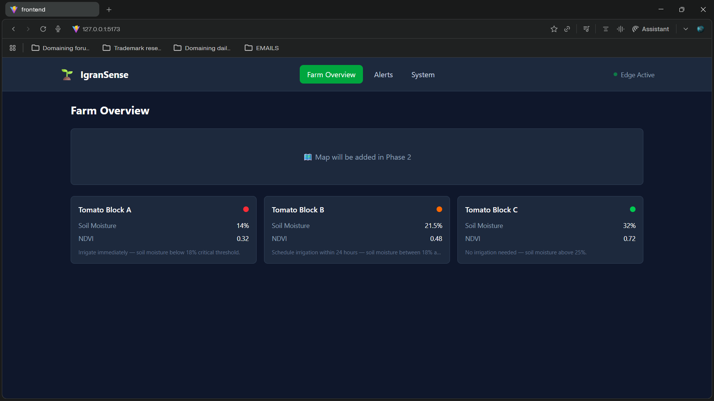
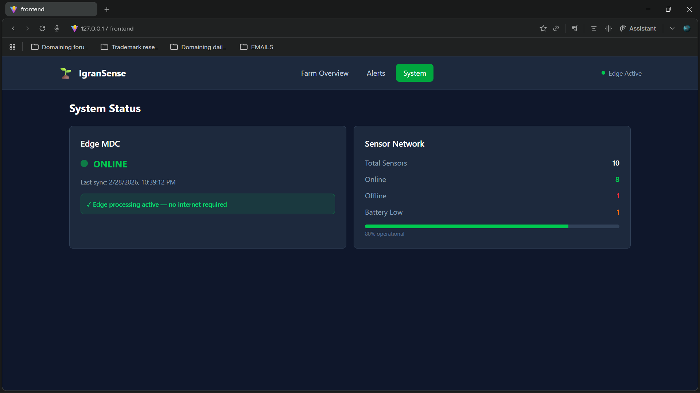

# 🌱 IgranSense

**Smart Irrigation Decision Support System for Mediterranean Agriculture**

[](docs/trl_statement.md)
[](LICENSE)

IgranSense is an edge-computing IoT platform that helps farmers optimize irrigation decisions using real-time soil moisture monitoring, satellite-derived vegetation indices (NDVI), and agronomic rule-based recommendations.

> **🚀 New here?** Check out [QUICKSTART.md](QUICKSTART.md) for a 5-minute setup guide!



## 🎯 Features

- **Real-time Monitoring** - Track soil moisture, temperature, and humidity across multiple fields
- **Smart Alerts** - Automated irrigation recommendations based on FAO-56 thresholds
- **NDVI Integration** - Weekly satellite imagery analysis for crop health assessment
- **Edge Computing** - Works offline; processes data locally without internet dependency
- **Visual Dashboard** - Interactive maps and time-series charts for field analysis
- **Role-Based Access** - Four user roles: Local Farm, Farmer, Enterprise, Admin
- **Multi-Farm Support** - Enterprise users can manage multiple farms
- **Sensor Registry** - Device inventory with status tracking and diagnostics

## 📸 Screenshots

| Farm Overview | Field Detail | System Status |
|---------------|--------------|---------------|
|  | Soil moisture & NDVI charts |  |

## 🏗️ Architecture

```
┌─────────────────────────────────────────────────────────────┐
│                      FIELD SENSORS                          │
│   Soil Moisture (×2)  •  Temperature  •  Humidity           │
└─────────────────────────┬───────────────────────────────────┘
                          │ LoRa 868MHz
                          ▼
              ┌───────────────────────┐
              │   Edge Gateway (MDC)   │
              │   FastAPI + Rules      │
              └───────────┬───────────┘
                          │ REST API
                          ▼
              ┌───────────────────────┐
              │   React Dashboard      │
              │   Leaflet + Recharts   │
              └───────────────────────┘
```

## 🚀 Quick Start

### Prerequisites

Before you begin, make sure you have the following installed on your machine:

| Software | Minimum Version | Check Command |
|----------|-----------------|---------------|
| Python | 3.10+ | `python3 --version` |
| Node.js | 20+ | `node --version` |
| npm | 10+ | `npm --version` |
| Git | Any | `git --version` |

> **Note:** On Windows, consider using Git Bash or WSL for the best experience.

### Step 1: Clone the Repository

```bash
git clone https://github.com/YOUR_USERNAME/IgranSense_MVP.git
cd IgranSense_MVP
```

### Step 2: Set Up Backend (Python + FastAPI)

```bash
# Create a Python virtual environment
python3 -m venv .venv

# Activate the virtual environment
# On Linux/macOS:
source .venv/bin/activate

# On Windows (Command Prompt):
# .venv\Scripts\activate.bat

# On Windows (PowerShell):
# .venv\Scripts\Activate.ps1

# Install Python dependencies
pip install -r backend/souhail-edge-sim/requirements.txt
```

**✅ Verify Backend Setup:**
```bash
cd backend/souhail-edge-sim
python -c "import fastapi; print('FastAPI installed successfully!')"
cd ../..
```

### Step 3: Set Up Frontend (React + Vite)

```bash
# Navigate to frontend directory
cd frontend

# Install Node.js dependencies
npm install

# Return to project root
cd ..
```

**✅ Verify Frontend Setup:**
```bash
cd frontend
npm list react --depth=0
cd ..
```

### Step 4: Run the Application

You need **two separate terminal windows** running simultaneously:

#### Terminal 1 - Start the Backend API:

```bash
cd backend/souhail-edge-sim

# Activate virtual environment (if not already active)
source ../../.venv/bin/activate  # Linux/macOS
# ..\..\Scripts\activate         # Windows

# Start the FastAPI server
uvicorn app.main:app --reload --host 127.0.0.1 --port 8000
```

You should see:
```
INFO:     Uvicorn running on http://127.0.0.1:8000 (Press CTRL+C to quit)
INFO:     Started reloader process
```

#### Terminal 2 - Start the Frontend Dashboard:

```bash
cd frontend

# Start the Vite development server
npm run dev
```

You should see:
```
  VITE v7.x.x  ready in xxx ms

  ➜  Local:   http://localhost:5173/
  ➜  Network: use --host to expose
```

### Step 5: Access the Application

Open your web browser and navigate to:

**🌐 http://localhost:5173**

> The frontend (port 5173) automatically proxies API requests to the backend (port 8000).

### Demo Users

Log in with any of these pre-configured accounts to explore different role capabilities:

| Email | Password | Role | What You Can Do |
|-------|----------|------|-----------------|
| `admin@igransense.com` | `demo123` | **Admin** | Access admin panel, manage users/orgs, view diagnostics |
| `enterprise@demo.com` | `demo123` | **Enterprise** | Multi-farm selector, full farm management |
| `farmer@demo.com` | `demo123` | **Farmer** | Complete farm access, alerts, reports |
| `local` | `demo123` | **Local Farm** | Basic monitoring and field status |

> All demo accounts use the password: **`demo123`**

## 🧪 Testing the Features

Once logged in, try these actions:

1. **Farm Overview** - Click colored field markers to see details
   - 🟢 Green = Healthy, 🟡 Yellow = Warning, 🔴 Red = Critical

2. **Field Detail** - View historical data:
   - 30-day soil moisture trends
   - Temperature time-series
   - Weekly NDVI bar charts

3. **Alerts Page** - Check irrigation recommendations
   - Sorted by severity (Critical → Warning → Info)

4. **System Status** - Monitor edge gateway and sensor health

5. **Admin Panel** (admin role only):
   - User management
   - Organization configuration
   - System diagnostics

## 🛠️ Troubleshooting

### Backend won't start

**Problem:** `ModuleNotFoundError: No module named 'fastapi'`  
**Solution:**
```bash
# Make sure virtual environment is activated
source .venv/bin/activate  # Linux/macOS
# .venv\Scripts\activate   # Windows

# Reinstall dependencies
pip install -r backend/souhail-edge-sim/requirements.txt
```

**Problem:** `Address already in use (port 8000)`  
**Solution:**
```bash
# Find and kill the process using port 8000
# Linux/macOS:
lsof -ti:8000 | xargs kill -9

# Windows:
netstat -ano | findstr :8000
taskkill /PID <PID> /F

# Or use a different port:
uvicorn app.main:app --reload --host 127.0.0.1 --port 8001
```

### Frontend won't start

**Problem:** `npm ERR! code ENOENT`  
**Solution:**
```bash
cd frontend
rm -rf node_modules package-lock.json
npm install
```

**Problem:** `Cannot GET /api/health`  
**Solution:** Make sure the backend is running on port 8000. Check the proxy configuration in [frontend/vite.config.js](frontend/vite.config.js).

### Login issues

**Problem:** `Invalid credentials`  
**Solution:** 
- Double-check the email and password from the Demo Users table above
- Make sure backend has loaded `data/users.json` correctly
- Check backend logs for authentication errors

### Module not found errors

**Problem:** Python ImportError  
**Solution:**
```bash
# Ensure you're in the correct directory
cd backend/souhail-edge-sim
pwd  # Should end with .../backend/souhail-edge-sim

# Run with python -m
python -m app.main
```

### Port conflicts

If ports 8000 or 5173 are already in use:

**Backend (change from 8000):**
```bash
uvicorn app.main:app --reload --port 8001
```
Then update `frontend/vite.config.js`:
```javascript
target: 'http://localhost:8001',  // Change from 8000
```

**Frontend (change from 5173):**
```bash
npm run dev -- --port 3000
```

## 🔄 Regenerating Mock Data

To create fresh 30-day sensor data:

```bash
# From project root
source .venv/bin/activate
python scripts/generate_mock_data.py
```

This generates:
- `backend/souhail-edge-sim/data/readings.json` (~14,000 readings)
- `backend/souhail-edge-sim/data/ndvi_snapshots.json` (15 weekly snapshots)

**Important:** Restart the backend server after regenerating data.

## 📁 Project Structure

```
IgranSense_MVP/
├── backend/
│   └── souhail-edge-sim/          # FastAPI edge simulation service
│       ├── app/
│       │   ├── main.py            # REST API endpoints & FastAPI app
│       │   ├── models.py          # Pydantic data models
│       │   ├── config.py          # Configuration settings
│       │   ├── enums.py           # Enumerations (roles, status, etc.)
│       │   ├── services/
│       │   │   ├── auth.py        # JWT authentication
│       │   │   ├── data_loader.py # JSON data loading
│       │   │   ├── rule_engine.py # Agronomic rules engine
│       │   │   └── system_health.py # System monitoring
│       │   └── utils/
│       │       └── time_utils.py  # Date/time utilities
│       ├── data/                  # JSON database files
│       │   ├── sensors.json       # Sensor inventory
│       │   ├── readings.json      # Historical sensor readings
│       │   ├── ndvi_snapshots.json # Satellite imagery data
│       │   ├── rules.json         # Agronomic threshold rules
│       │   ├── fields.json        # Field configurations
│       │   └── users.json         # User accounts
│       ├── requirements.txt       # Python dependencies
│       └── README.md
├── frontend/                      # React dashboard application
│   ├── src/
│   │   ├── App.jsx                # Main application component
│   │   ├── main.jsx               # Entry point
│   │   ├── components/            # React UI components
│   │   │   ├── FarmOverview.jsx   # Interactive map view
│   │   │   ├── FieldDetail.jsx    # Single field analysis
│   │   │   ├── AlertsList.jsx     # Irrigation alerts
│   │   │   ├── SystemStatus.jsx   # Edge MDC monitoring
│   │   │   ├── SensorRegistry.jsx # Device inventory
│   │   │   ├── auth/              # Authentication components
│   │   │   ├── shared/            # Reusable UI elements
│   │   │   └── ...
│   │   ├── pages/                 # Page components
│   │   │   ├── LoginPage.jsx      # Authentication page
│   │   │   └── admin/             # Admin panel pages
│   │   ├── context/               # React Context providers
│   │   │   ├── AuthContext.jsx    # Auth state management
│   │   │   └── FarmContext.jsx    # Farm data management
│   │   ├── api/
│   │   │   └── client.js          # API client wrapper
│   │   ├── styles/
│   │   │   └── tokens.js          # Design system tokens
│   │   └── utils/
│   │       └── rolePermissions.js # Role-based access control
│   ├── public/                    # Static assets
│   ├── package.json               # Node.js dependencies
│   ├── vite.config.js             # Vite configuration
│   └── index.html                 # HTML entry point
├── scripts/
│   └── generate_mock_data.py      # 30-day data generator
├── docs/                          # Documentation
│   ├── scientific_basis.md        # Agronomic methodology
│   ├── trl_statement.md           # Technology readiness level
│   ├── hardware_spec.md           # Bill of materials
│   ├── quick_ref.md               # Quick reference guide
│   └── MVP_SPRINT_PLAN.md         # Development roadmap
├── screenshots_frontend/          # Application screenshots
│   ├── farmview_page.png
│   ├── alerts_page.png
│   └── system_page.png
├── .gitignore                     # Git ignore rules
├── LICENSE                        # MIT License
├── README.md                      # This file
└── SETUP.md                       # Detailed setup guide
```

## 🔌 API Endpoints

The backend exposes these REST API endpoints:

| Endpoint | Method | Description | Auth Required |
|----------|--------|-------------|---------------|
| `/health` | GET | Health check | ❌ |
| `/auth/login` | POST | User authentication | ❌ |
| `/auth/me` | GET | Get current user | ✅ |
| `/fields` | GET | List all fields with status | ✅ |
| `/fields/{id}` | GET | Get field details & history | ✅ |
| `/alerts` | GET | Active irrigation alerts | ✅ |
| `/system` | GET | MDC & sensor health | ✅ |
| `/sensors` | GET | Sensor inventory | ✅ |
| `/users` | GET | List users (admin only) | ✅ |

### Testing API Directly

You can test the API using `curl` or any HTTP client:

```bash
# Health check (no auth required)
curl http://127.0.0.1:8000/health

# Login and get token
curl -X POST http://127.0.0.1:8000/auth/login \
  -H "Content-Type: application/json" \
  -d '{"email":"farmer@example.com","password":"demo123"}'

# Use token to get fields (replace YOUR_TOKEN)
curl http://127.0.0.1:8000/fields \
  -H "Authorization: Bearer YOUR_TOKEN"

# Get specific field data
curl http://127.0.0.1:8000/fields/field_1 \
  -H "Authorization: Bearer YOUR_TOKEN"

# Get active alerts
curl http://127.0.0.1:8000/alerts \
  -H "Authorization: Bearer YOUR_TOKEN"

# Get system status
curl http://127.0.0.1:8000/system \
  -H "Authorization: Bearer YOUR_TOKEN"
```

> **Tip:** Visit http://127.0.0.1:8000/docs for interactive API documentation (Swagger UI) when the backend is running.

## 🔬 Scientific Basis

IgranSense uses established agronomic thresholds:

| Metric | Critical | Warning | Optimal |
|--------|----------|---------|---------|
| Soil Moisture (VWC) | <18% | 18-25% | 25-45% |
| NDVI | <0.30 | 0.30-0.50 | >0.70 |

Based on FAO Irrigation and Drainage Paper 56 (Allen et al., 1998).

See [docs/scientific_basis.md](docs/scientific_basis.md) for details.

## 🛠️ Technology Stack

**Backend:**
- FastAPI (Python)
- Pydantic for data validation
- Uvicorn ASGI server

**Frontend:**
- React 19 + Vite 7
- Tailwind CSS 4
- Leaflet for maps
- Recharts for visualizations

**Planned Hardware:**
- ESP32 + LoRa SX1276 sensor nodes (~$66/unit)
- Raspberry Pi 4 edge gateway (~$195)
- Capacitive soil moisture sensors

## 📈 Roadmap

- [x] MVP Dashboard with mock data
- [x] 30-day historical data visualization
- [x] Documentation (scientific basis, TRL, hardware spec)
- [x] JWT Authentication with role-based access
- [x] Multi-farm support for enterprise users
- [x] Sensor registry with device inventory
- [x] Admin panel (users, organizations, diagnostics)
- [x] Enhanced UX with design tokens
- [ ] ESP32 firmware development
- [ ] Real sensor integration
- [ ] Mobile responsive design improvements
- [ ] Cloud sync for enterprise deployments
- [ ] WebSocket real-time updates
- [ ] Data export (CSV/PDF reports)
- [ ] Email/SMS alert notifications

## 💻 Development Tips

### Backend Development

```bash
# Run backend with auto-reload (for development)
cd backend/souhail-edge-sim
uvicorn app.main:app --reload --host 127.0.0.1 --port 8000

# Run tests (if implemented)
pytest

# Check code formatting
black app/
flake8 app/
```

### Frontend Development

```bash
# Run with HMR (Hot Module Replacement)
npm run dev

# Build for production
npm run build

# Preview production build
npm run preview

# Lint code
npm run lint
```

### Adding New Features

1. **Backend API endpoint:**
   - Add route in `backend/souhail-edge-sim/app/main.py`
   - Define models in `app/models.py`
   - Add business logic in `app/services/`

2. **Frontend component:**
   - Create component in `frontend/src/components/`
   - Add API call in `frontend/src/api/client.js`
   - Update routing in `App.jsx` if needed

## 🤝 Contributing

Contributions are welcome! Please follow these guidelines:

1. Fork the repository
2. Create a feature branch (`git checkout -b feature/AmazingFeature`)
3. Commit your changes (`git commit -m 'Add some AmazingFeature'`)
4. Push to the branch (`git push origin feature/AmazingFeature`)
5. Open a Pull Request

### Code Style

- **Python:** Follow PEP 8, use `black` for formatting
- **JavaScript:** Follow ESLint rules, use ES6+ syntax
- **Commits:** Use conventional commits (feat:, fix:, docs:, etc.)

## 📚 Additional Resources

- **[QUICKSTART.md](QUICKSTART.md)** - Get running in 5 minutes!
- **[SETUP.md](SETUP.md)** - Detailed setup and testing guide
- **[CONTRIBUTING.md](CONTRIBUTING.md)** - Contribution guidelines
- [docs/scientific_basis.md](docs/scientific_basis.md) - Agronomic methodology
- [docs/trl_statement.md](docs/trl_statement.md) - Technology readiness level
- [docs/hardware_spec.md](docs/hardware_spec.md) - Hardware specifications
- [docs/MVP_SPRINT_PLAN.md](docs/MVP_SPRINT_PLAN.md) - Development roadmap
- [backend/Edge API Design.md](backend/Edge%20API%20Design.md) - API design document
- [launch.md](launch.md) - Quick launch commands reference

## ❓ FAQ

### Can I use this with real sensors?

The current version uses simulated data. To integrate real sensors, you'll need to:
1. Implement sensor drivers (e.g., for ESP32)
2. Replace the JSON data loader with real-time data ingestion
3. Add a time-series database (e.g., InfluxDB)

### Does it work offline?

Yes! The edge architecture is designed to work without internet. Only satellite NDVI updates require periodic connectivity.

### What about data security?

- JWT tokens for authentication
- Passwords hashed with bcrypt
- HTTPS recommended for production
- Role-based access control (RBAC)

### Can I deploy this to production?

The current version is an MVP (TRL 4). Before production:
- Add real sensor integration
- Implement data persistence (PostgreSQL/InfluxDB)
- Set up proper SSL/TLS
- Configure environment variables
- Implement backup and monitoring
- Add comprehensive tests

### How do I change the location/coordinates?

Edit the field coordinates in `backend/souhail-edge-sim/data/fields.json`:
```json
{
  "field_id": "field_1",
  "name": "Field 1",
  "latitude": 31.6369,
  "longitude": -7.9896,
  ...
}
```

## 👥 Team

Developed for the UM6P Launchpad program.

**Project Type:** Smart Agriculture IoT Solution  
**Technology Readiness Level:** TRL 4 (Validated in lab)  
**Target Market:** Small-to-medium farms in Mediterranean regions

## 📄 License

This project is licensed under the MIT License - see the [LICENSE](LICENSE) file for details.

## 🙏 Acknowledgments

- **FAO** for irrigation guidelines (Irrigation and Drainage Paper 56)
- **OpenStreetMap** contributors for mapping data
- **Sentinel-2** (ESA) for NDVI satellite imagery
- **UM6P Launchpad** for incubation support
- Open source community for excellent tools (FastAPI, React, Vite, etc.)

---

**Questions?** Open an issue or reach out to the team.

**Happy coding! 🌱💧**
